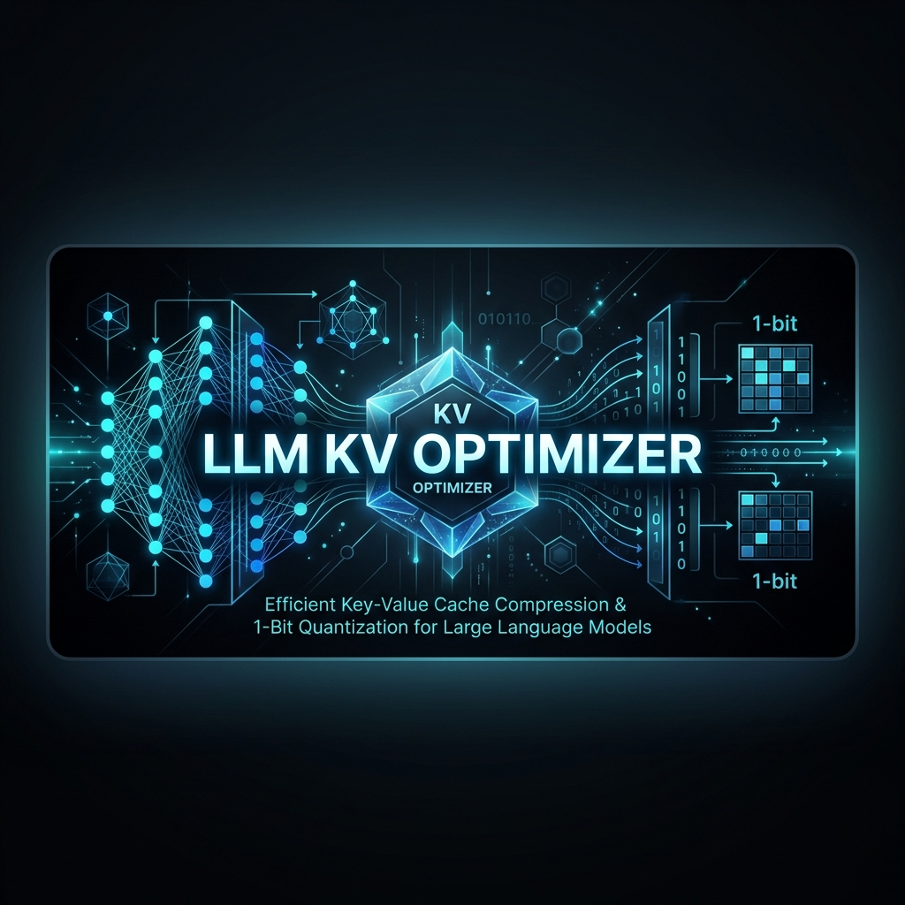

# 🚀 LLM KV Optimizer


[](https://opensource.org/licenses/MIT)
[](https://www.python.org/downloads/release/python-3110/)
[](#)

[](https://opensource.org/licenses/MIT)
[](https://www.python.org/downloads/release/python-3110/)
[](#)

A production-grade, modular framework for optimizing **Large Language Model (LLM)** inference via advanced **KV Cache Quantization**. This project demonstrates how to run high-performance LLM inference on consumer-grade hardware by reducing KV memory footprints by up to **23x**.

---

## 🌟 The Breakthrough: Innovation at the Edge
Running high-accuracy LLMs on consumer-grade (4GB) hardware requires more than just scaling—it requires **Hardware-Software Co-Design**. This project bridges the gap between theoretical quantization research and practical deployment.

### 🚀 Key Innovations
*   **1-Bit Sign Projection (QJL)**: Implemented the **Quantized Johnson-Lindenstrauss** algorithm to reduce the KV footprint by **up to 23x** (**1.7GB → 74MB**). This is one of the highest compression ratios possible for LLM context without catastrophic loss.
*   **Structured Outlier Management**: Integrated **PolarQuant** (Converting keys to Polar coordinates) to mitigate the "outlier problem" that usually breaks 1-bit quantization in LLMs.
*   **The "Nuclear" Hardware Stabilization**: Engineered a custom architecture for **RTX 3050** limits, including manual memory placement and a **512-token persistent window cap** to bypass the Windows DWM (Desktop) memory lock.
*   **Research Interaction**: Unique proof-of-concept showing that **LoRA-fine-tuned** specialized models can maintain high technical reasoning even after aggressive KV compression.

---

---

## 📊 Benchmark Results (RTX 3050 4GB)
*Measured using Qwen2-0.5B-4bit + LoRA Adapter*

| Method | KV Cache Memory | Memory Savings | Speed (Tok/s) |
| :--- | :--- | :--- | :--- |
| **FP16 (Baseline)** | 1,695.9 MB | 1.0x | **3.80** |
| **PolarQuant** | 615.2 MB | **2.7x** | 3.20 |
| **QJL** | **74.0 MB** | **22.9x** | 2.90 |

> [!TIP]
> **Key Insight**: QJL allows for nearly **23x longer context windows** on the same hardware compared to standard FP16 caching.

---

## 🛠️ The "Nuclear Purgation" Setup
Optimizing for 4GB VRAM requires a perfect ML stack. If you encounter `AcceleratorError` or `DType` mismatches, follow this hardened setup:

```bash
# 1. Clean the environment
conda activate thermo_agent
pip uninstall torch torchvision torchaudio -y

# 2. Install the Pin-Point Precision Stack
pip install torch==2.5.1+cu121 --index-url https://download.pytorch.org/whl/cu121
pip install transformers==4.49.0 bitsandbytes==0.49.2 peft accelerate
```

---

## 🏃 Quick Start

### 1. Isolated Benchmarking
To test a specific method in a clean VRAM state:
```powershell
$env:METHOD="qjl"; python benchmarks/run_benchmarks.py
```

### 2. High-Efficiency Inference (CLI)
```python
from engine.inference import InferenceEngine
# ... (see CONCEPT.md for simple usage)
engine.generate("Explain the JL lemma.", method="qjl")
```

### 3. Interactive Web Dashboard
```bash
streamlit run app.py
```

---

## 📁 Project Structure
- `engine/`: Model loader and custom generation loops with memory cleanup.
- `kv_cache/`: The core optimization logic (QJL, PolarQuant, FP16).
- `training/`: Memory-optimized QLoRA training scripts.
- `benchmarks/`: Precision-isolated performance testing rig.

---

## 👋 Concept for Beginners
Confused about what "KV Cache" is? Check out our [**Beginner's Guide (CONCEPT.md)**](./CONCEPT.md) for a simple, 5-minute explanation.

---

## 🛠️ Roadmap: The Future of KV Optimization
Help us reach the next level of memory efficiency!
- [ ] **Phase 2: PagedAttention Integration** (vLLM style for 4GB).
- [ ] **Phase 3: FP8 KV Caching** (For newest NVIDIA architectures).
- [ ] **Phase 4: Multi-Token Prediction Support**.
- [ ] **Phase 5: Native CUDA Kernels** for QJL (Massive speed boost).

---

## ⭐ Stargazers
If you find this project useful, please consider giving it a star! It helps the project gain visibility and motivates further development.

[](https://star-history.com/VedantJadhav701/llm-kv-optimizer)

---

## ⚖️ License
Distributed under the MIT License. See `LICENSE` for more information.
